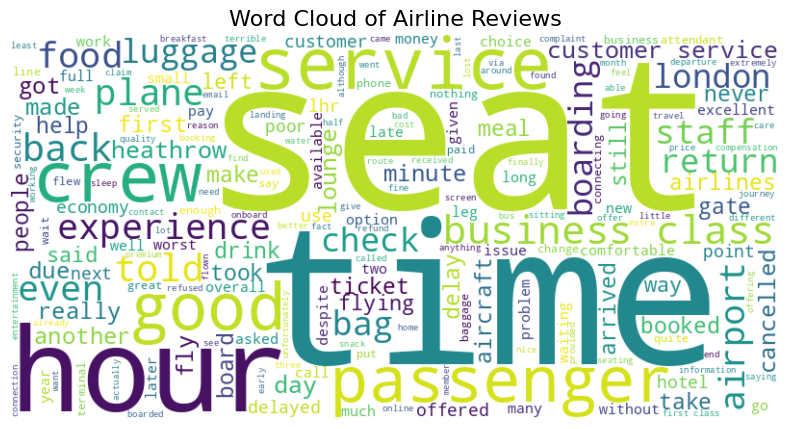
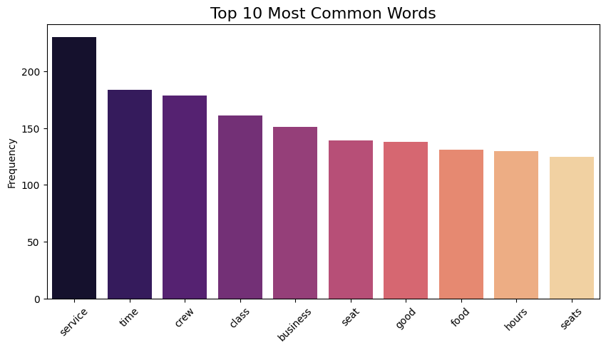
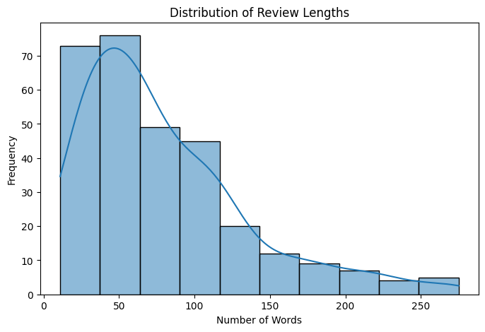
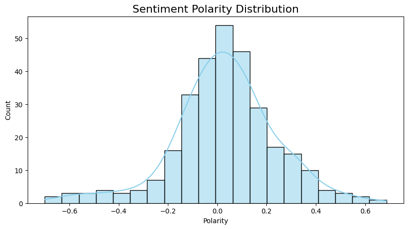
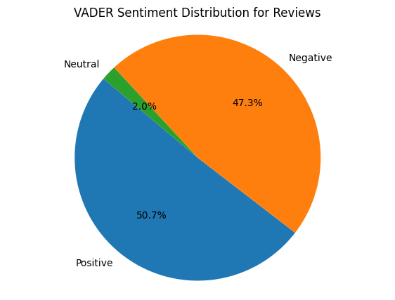
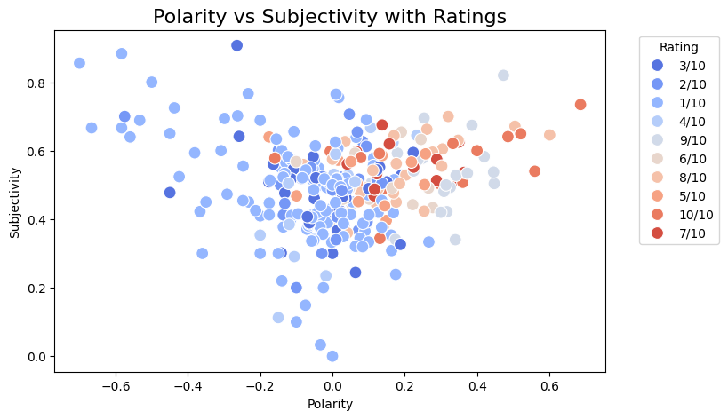

# British Airways Reviews Sentiment Analysis

This project performs exploratory data analysis (EDA) and sentiment analysis on customer reviews of **British Airways** using Natural Language Processing (NLP) techniques in Python.

---

## Project Setup

### 1. Install Required Libraries

To run this project, install the following Python libraries:

```bash
pip install pandas matplotlib seaborn wordcloud nltk textblob
```

### 2. Import Libraries

```python
import pandas as pd
import matplotlib.pyplot as plt
import seaborn as sns
from wordcloud import WordCloud
import nltk
from nltk.corpus import stopwords
from nltk.tokenize import word_tokenize
from textblob import TextBlob
import re
```

---

## Data Loading

The dataset (`british-airways-review.csv`) was loaded into a pandas DataFrame.
Key columns include: `Reviewer`, `Date`, `Rating`, `Review`, and `heading1`.

---

## Data Cleaning and Preprocessing

### Steps Taken:

* Checked for missing values and data types using `df.info()`.
* Converted text to lowercase.
* Removed domain-specific stopwords such as `flight`, `airline`, `ba`, etc.
* Tokenized the text and removed punctuation and standard stopwords.

```python
custom_stopwords = set(stopwords.words('english'))
custom_stopwords.update(['ba', 'flight', 'airline', 'flights', 'airways', 'trip', 'verified', '|','british','us','would','one','cabin'])
```

---

## Word Cloud Visualization

A word cloud was generated to visualize the most frequently mentioned terms in customer reviews.



---

## Most Common Words

A bar chart visualizing the top 10 most frequently occurring words in the reviews.



| Word    | Frequency |
| ------- | --------- |
| service | High      |
| staff   | High      |
| seat    | Moderate  |
| food    | Moderate  |
| delay   | Moderate  |

---

## Review Length Analysis

A histogram was used to analyze the length of customer reviews.



* Most reviews contain between 50 to 150 words, indicating moderate review depth.

---

## Sentiment Analysis

### Metrics Computed:

* **Polarity**: Measures sentiment on a scale from -1 (negative) to 1 (positive).
* **Subjectivity**: Indicates how subjective or opinion-based the review is (0 to 1).



```python
df['polarity'] = df['cleaned_reviews'].apply(lambda x: TextBlob(x).sentiment.polarity)
df['subjectivity'] = df['cleaned_reviews'].apply(lambda x: TextBlob(x).sentiment.subjectivity)
```

### Insight:

Most reviews are clustered around neutral to slightly positive polarity, suggesting general satisfaction but also variability in experience.

---

## Sentiment Classification

Both **TextBlob** and **VADER** tools were used to classify sentiment for both `heading1` and `Review` fields.

#### VADER Classification Logic:

```python
# Classification thresholds:
compound >= 0.05 → Positive  
compound <= -0.05 → Negative  
otherwise → Neutral
```

#### Distribution Overview:



* **VADER Results**:

  * Positive: \~50%
  * Neutral: \~30%
  * Negative: \~20%
* **TextBlob Results**:

  * Similar distribution, with slightly fewer negative reviews.

---

## Polarity vs. Subjectivity

A scatter plot was used to explore the relationship between review polarity and subjectivity.



* No strong correlation observed.
* Most reviews are moderately subjective and centered around neutral polarity.

---

## Summary of Insights

* **Key Themes**: Common topics include service, food quality, seating comfort, and delays.
* **Sentiment Overview**:

  * Most reviews are positive or neutral, indicating general customer satisfaction.
  * A notable minority expressed dissatisfaction, particularly about delays and service quality.
* **Validation**:

  * Using both VADER and TextBlob enhances the robustness of sentiment classification.

Sure! Here's the rewritten version without icons:

---

### Prescriptive Analysis: What Can the Business Owner Do?

Based on the sentiment analysis and NLP results from British Airways customer reviews, the following are actionable recommendations that the business owner can implement to improve service quality and customer satisfaction:

---

**1. Focus on Negative Sentiment Areas**

Insights:

* A significant portion of reviews show negative sentiment, particularly in review texts.
* Common negative themes include issues like delays, poor customer service, uncomfortable seating, and lost baggage.

Actionable Steps:

* Work on reducing flight delays and improve communication with passengers during disruptions.
* Train staff to improve customer service skills, focusing on empathy and professionalism.
* Enhance baggage handling procedures to minimize lost or delayed luggage incidents.

---

**2. Leverage Positive Feedback**

Insights:

* Many reviews express positive sentiment, highlighting good experiences with staff, comfort, and service.

Actionable Steps:

* Promote positive reviews through marketing campaigns and on booking platforms.
* Identify staff or service areas responsible for positive feedback and use them as benchmarks for other teams.
* Offer loyalty rewards or incentives to customers who consistently provide positive feedback.

---

**3. Enhance the Review Experience**

Insights:

* A considerable number of reviews are neutral, suggesting vague or unremarkable experiences.

Actionable Steps:

* Modify the review process to include specific prompts, such as rating inflight entertainment, cleanliness, or staff helpfulness.
* Encourage customers to leave detailed reviews by simplifying the process or offering small incentives.

---

**4. Use Data for Continuous Improvement**

Insights:

* Word clouds and text length distributions provide insight into recurring themes and how customers express feedback.
* Sentiment polarity and subjectivity help identify emotionally charged or strongly opinionated feedback.

Actionable Steps:

* Develop a dashboard to monitor sentiment trends in real time.
* Segment customer feedback by flight route, class of service, or season to uncover specific areas needing improvement.

---

**5. Personalized Customer Outreach**

Insights:

* Strongly negative reviews highlight the need for better follow-up and resolution practices.

Actionable Steps:

* Use sentiment analysis tools to flag highly negative reviews and prioritize follow-up.
* Implement a customer recovery process by responding to complaints with personalized messages, compensation offers, or apologies.

---

**6. Benchmark Against Competitors**

Actionable Steps:

* Conduct similar sentiment analysis on competitors’ customer reviews.
* Use the findings to identify where British Airways can differentiate or improve its service compared to industry standards.

---

By taking these actions, the business owner can use data-driven insights to enhance service quality, reduce complaints, and improve overall customer experience and loyalty.


---

## Project Structure

```
airline-review-analysis/
├── british-airways-review.csv
├── british_airways.ipynb
├── README.md
```

---

## Potential Improvements

* Apply **topic modeling** (e.g., LDA) to uncover hidden themes in reviews.
* Add **interactive visualizations** using Plotly or Dash.
* Train a **machine learning model** to classify sentiments more accurately.

---

## References

* [NLTK Documentation](https://www.nltk.org/)
* [TextBlob Documentation](https://textblob.readthedocs.io/en/dev/)
* [VADER Sentiment Analysis](https://github.com/cjhutto/vaderSentiment)
* [WordCloud Library](https://github.com/amueller/word_cloud)